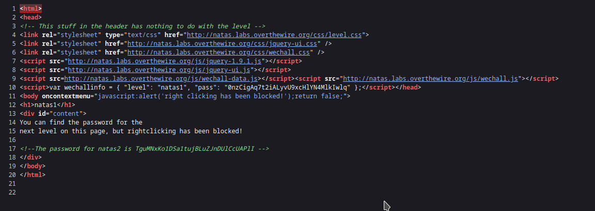
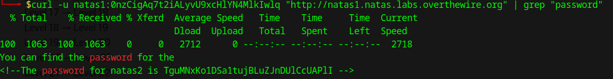

# Natas Level 1 → Level 2

**Difficulty:** ⭐ Very Easy  
**Date Completed:** 2025-11-12  
**Author:** AlperKurtulus

---

## Level Goal

Find the password for the next level on this page, but right-clicking has been blocked.

**Access Information:**
- URL: http://natas1.natas.labs.overthewire.org
- Username: `natas1`
- Password: `0nzCigAq7t2iALyvU9xcHlYN4MlkIwlq`

---

## Solution

### Step 1: Access the Challenge Page

Navigate to http://natas1.natas.labs.overthewire.org and log in with the credentials above.

### Step 2: Observe the Right-Click Block

The page displays: *"You can find the password for the next level on this page, but right-clicking has been blocked!"*

Attempting to right-click shows that the context menu is disabled via JavaScript.

### Step 3: Bypass the Restriction

There are multiple ways to view the page source without right-clicking:

1. **Keyboard Shortcut:** Press `Ctrl+U` (Windows/Linux) or `Cmd+U` (Mac)
2. **Browser Menu:** Use the browser menu → View → Page Source
3. **Developer Tools:** Press `F12` to open Developer Tools and inspect the Elements tab
4. **URL Prefix:** Add `view-source:` before the URL

### Step 4: Find the Password

In the page source, find the HTML comment:

```html
<!--The password for natas2 is TguMNxKo1DSa1tujBLuZJnDUlCcUAPlI -->
```

---

## Automated Solution

A Python script is provided to automate this challenge:

📄 **Script:** [`natas1_v1.py`](./natas1_v1.py)

```bash
# Run from this directory
python3 natas1_v1.py
```

The script bypasses the JavaScript restriction entirely by making a direct HTTP request — JavaScript-based protections don't affect server-side requests.

---

## What I Learned

### Key Takeaways
- **Client-side restrictions are easily bypassed** — JavaScript protections only affect browser behavior.
- **Multiple methods exist to view source** — knowing alternatives is essential for web security.
- Direct HTTP requests (via curl, Python, etc.) ignore all client-side JavaScript.

### Security Implications
- **Never rely on client-side controls for security** — they provide no real protection.
- Any data sent to the client can be viewed, regardless of JavaScript restrictions.
- This is a classic example of **security through obscurity** — which is not real security.

---

## Tools Used

| Tool | Purpose |
|------|---------|
| Web Browser | Access challenge and observe restriction |
| Keyboard Shortcuts | Bypass right-click block (`Ctrl+U`) |
| Developer Tools | Inspect page elements directly |
| Python + Requests | Automated HTTP requests bypassing JS |

---

## 📸 Screenshots




---

## Navigation

[← Previous: Level 0](../level-0/README.md) | [Overview](../README.md) | [Next: Level 2 →](../level-2/README.md)