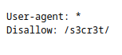
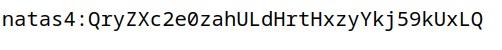
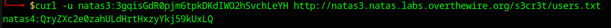

# Natas Level 3 → Level 4

**Difficulty:** ⭐ Easy  
**Date Completed:** 2025-11-12  
**Author:** AlperKurtulus

---

## Level Goal

There is nothing on this page... but the source gives a hint about what search engines won't find.

**Access Information:**
- URL: http://natas3.natas.labs.overthewire.org
- Username: `natas3`
- Password: `3gqisGdR0pjm6tpkDKdIWO2hSvchLeYH`

---

## Solution

### Step 1: Access the Challenge Page

Navigate to http://natas3.natas.labs.overthewire.org and log in with the credentials above.

### Step 2: Analyze the Page Source

The page displays: *"There is nothing on this page"*

View the source code (`Ctrl+U`) and find an interesting comment:

```html
<!-- No more information leaks!! Not even Google will find it this time... -->
```

This is a hint about **robots.txt** — a file that tells search engines what not to index!

### Step 3: Check robots.txt

Navigate to http://natas3.natas.labs.overthewire.org/robots.txt

The file contains:

```
User-agent: *
Disallow: /s3cr3t/
```

There's a hidden directory `/s3cr3t/` that's blocked from search engines!

### Step 4: Explore the Secret Directory

Navigate to http://natas3.natas.labs.overthewire.org/s3cr3t/

The directory listing reveals a `users.txt` file.

### Step 5: Access users.txt

Navigate to http://natas3.natas.labs.overthewire.org/s3cr3t/users.txt

The file contains:

```
natas4:QryZXc2e0zahULdHrtHxzyYkj59kUxLQ
```

The password for natas4 is: `QryZXc2e0zahULdHrtHxzyYkj59kUxLQ`

---

## Automated Solution

A Python script is provided to automate this challenge:

📄 **Script:** [`natas3_v1.py`](./natas3_v1.py)

```bash
# Run from this directory
python3 natas3_v1.py
```

The script directly accesses the known secret path and extracts the password from users.txt.

---

## What I Learned

### Key Takeaways
- **robots.txt is not a security mechanism** — it's merely a suggestion for well-behaved crawlers.
- **Security through obscurity fails again** — hiding a directory from Google doesn't hide it from attackers.
- Always check `/robots.txt` during security assessments — it often reveals "hidden" paths.

### Security Implications
- **Never use robots.txt to hide sensitive content** — assume anything listed will be checked by attackers.
- Disallowed paths in robots.txt are essentially a roadmap for security researchers.
- This is another case of **Information Disclosure** through misconfigured security measures.
- Proper security requires authentication and authorization, not path obscurity.

---

## Tools Used

| Tool | Purpose |
|------|---------|
| Web Browser | Navigate and view source |
| robots.txt Analysis | Discover disallowed directories |
| Directory Enumeration | Explore hidden paths |
| Python + Requests | Automated credential extraction |

---

## 📸 Screenshots





---

## Navigation

[← Previous: Level 2](../level-2/README.md) | [Overview](../README.md) | [Next: Level 4 →](../level-4/README.md)
