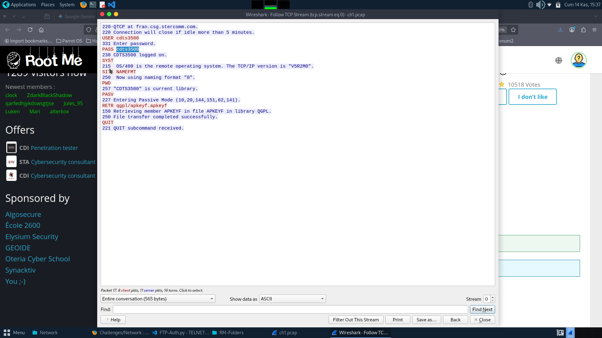

# FTP Authentication

**Platform:** Root-me  
**Category:** Network  
**Difficulty:** ⭐ Easy  
**Date Solved:** November 2025

---

## 📋 Challenge Description

This challenge involves analyzing an IBM iSeries communication trace log to extract FTP credentials. The file is encoded in UTF-16 format and contains authentication data transmitted during an FTP session.

**Objective:** Extract the password from the FTP communication trace.

---

## 🎯 Learning Objectives

- Analyze communication trace logs
- Handle different text encodings (UTF-16)
- Identify authentication patterns in logs
- Understand FTP protocol basics
- Parse structured log files

---

## 🔍 Initial Analysis

### Understanding the Challenge

The challenge provides an IBM iSeries communication trace log file. Key observations:
1. File is encoded in UTF-16 Little Endian format
2. Contains FTP session communication
3. Credentials are transmitted in plaintext

### FTP Authentication Flow

```
Client → Server: USER username
Server → Client: 331 Password required
Client → Server: PASS password
Server → Client: 230 User logged in
```

FTP transmits credentials in cleartext, making them visible in network captures.

---

## 🕵️ Reconnaissance

### Step 1: Identify File Encoding

The file doesn't open correctly with default UTF-8 encoding:
```bash
file ch1.pcap
# Output indicates UTF-16 LE encoding
```

### Step 2: Examine Log Structure

The trace log contains communication data with keywords like:
- `USER` - Username command
- `PASS` - Password command
- Various FTP response codes

---

## 💥 Exploitation

### Solution Approach

1. **Open with Correct Encoding** - Use UTF-16 encoding
2. **Search for Keywords** - Look for "PASS" in the data
3. **Extract Surrounding Context** - Get lines around the match
4. **Identify the Password** - Parse the credential value

### Python Script

The solution script (`FTP-Auth.py`) automates this process:

```python
def analyze_trace_log(log_file):
    # Open with UTF-16 encoding
    with open(log_file, "r", encoding='UTF-16') as f:
        lines = f.readlines()
    
    for i, line in enumerate(lines):
        lower_line = line.lower()
        if "pass" in lower_line:
            print(f"[+] Found on Line {i+1}:")
            print(line.strip())
            
            # Print context lines
            for offset in range(1, 50):
                next_index = i + offset
                if next_index < len(lines):
                    print(f" --> {lines[next_index].strip()}")
```

### Key Code Sections

#### UTF-16 Encoding Handling
```python
with open(log_file, "r", encoding='UTF-16') as f:
    lines = f.readlines()
```
Specifying the correct encoding is crucial for reading the file properly.

#### Keyword Search
```python
if "pass" in lower_line:
```
Case-insensitive search for password-related data.

---

## 🔑 Solution

**Steps to solve:**
1. Download the challenge file
2. Run the Python script against the file
3. The script finds lines containing "pass"
4. Review the output for the password value
5. Submit the password as the flag

**Flag:** `[hidden for learning purposes]`

---

## 📚 Lessons Learned

### 1. File Encoding Matters

Different encoding types:
- **UTF-8** - Most common, variable-width encoding
- **UTF-16** - Fixed 2-byte or variable-width encoding
- **ASCII** - 7-bit character encoding
- **Latin-1** - 8-bit Western European encoding

```python
# Try different encodings
encodings = ['utf-8', 'utf-16', 'utf-16-le', 'utf-16-be', 'latin-1']
for enc in encodings:
    try:
        with open(file, 'r', encoding=enc) as f:
            data = f.read()
        print(f"Success with {enc}")
        break
    except UnicodeError:
        continue
```

### 2. FTP Protocol Security

**FTP Commands:**
```
USER <username>    # Send username
PASS <password>    # Send password (plaintext!)
LIST               # List directory
RETR <file>        # Download file
STOR <file>        # Upload file
QUIT               # End session
```

**Security Issues:**
- Credentials transmitted in cleartext
- No encryption by default
- Vulnerable to sniffing attacks

### 3. Log Analysis Techniques

```python
# Search patterns for credentials
keywords = ['pass', 'password', 'user', 'login', 'auth', 'credential']

for line in lines:
    for keyword in keywords:
        if keyword in line.lower():
            print(f"Found: {line}")
```

---

## 🛡️ Security Implications

### Why This Matters

1. **Plaintext Credentials** - FTP transmits passwords unencrypted
2. **Network Sniffing** - Attackers can capture FTP sessions
3. **Legacy Protocols** - Many systems still use insecure FTP

### Defense Recommendations

- ✅ Use SFTP (SSH File Transfer Protocol) instead of FTP
- ✅ Use FTPS (FTP Secure with TLS) if FTP is required
- ✅ Implement VPN for FTP connections
- ✅ Use key-based authentication when possible
- ✅ Monitor and log FTP access

### Secure Alternatives

| Protocol | Encryption | Port |
|----------|------------|------|
| FTP      | ❌ None    | 21   |
| FTPS     | ✅ TLS     | 990  |
| SFTP     | ✅ SSH     | 22   |
| SCP      | ✅ SSH     | 22   |

---

## 🛠️ Tools Used

- **Python 3** - Scripting language
- **Text editors** - For manual file inspection
- **Wireshark** - Network protocol analyzer (optional)
- **file command** - Identify file encoding

---

## 📖 References

- [FTP Protocol (RFC 959)](https://tools.ietf.org/html/rfc959)
- [SFTP Protocol](https://en.wikipedia.org/wiki/SSH_File_Transfer_Protocol)
- [Python Encoding](https://docs.python.org/3/howto/unicode.html)
- [IBM iSeries Trace](https://www.ibm.com/docs/en/i)

---

## 📷 Screenshots

- 

---

## 🔗 Navigation

- [← Back to Network Overview](../README.md)
- [Previous: Ethernet Frame](../ethernet-frame/README.md)
- [Next: Telnet Authentication →](../telnet-auth/README.md)


---

**Date Completed:** November 2025  
**Time Taken:** 15 minutes  
**Difficulty Rating:** 2/10

---

*This challenge highlights why FTP should be replaced with secure alternatives!*
