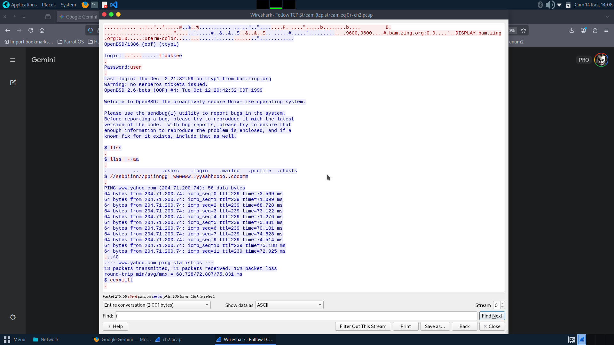

# Telnet Authentication

**Platform:** Root-me  
**Category:** Network  
**Difficulty:** ⭐ Easy  
**Date Solved:** November 2025

---

## 📋 Challenge Description

This challenge involves analyzing a PCAP file containing Telnet traffic to extract authentication credentials. Telnet transmits all data, including passwords, in plaintext, making it straightforward to capture credentials from network traffic.

**Objective:** Extract the password from the Telnet session capture.

---

## 🎯 Learning Objectives

- Analyze PCAP files with Python and Scapy
- Understand TCP stream reassembly
- Identify Telnet protocol characteristics
- Extract credentials from network captures
- Develop packet analysis skills

---

## 🔍 Initial Analysis

### Understanding the Challenge

The challenge provides a PCAP file containing captured Telnet traffic. Key points:
1. Telnet uses TCP port 23
2. All data is transmitted in plaintext
3. Credentials can be extracted by reassembling the TCP stream

### Telnet Protocol Overview

```
+--------+     TCP:23      +--------+
| Client | <-------------> | Server |
+--------+                 +--------+
    |                          |
    | login: username          |
    | Password: ********       |
    | Welcome message          |
    |                          |
```

Telnet transmits everything in cleartext, including:
- Usernames and passwords
- Commands and responses
- All session data

---

## 🕵️ Reconnaissance

### Step 1: Examine the PCAP File

Using Scapy to load and analyze the packets:
```python
from scapy.all import rdpcap
packets = rdpcap("ch2.pcap")
print(f"Total packets: {len(packets)}")
```

### Step 2: Identify Relevant Packets

Filter for TCP packets with actual payload data:
- Skip TCP handshake packets (SYN, ACK)
- Look for packets with Raw layer (actual data)

---

## 💥 Exploitation

### Solution Approach

1. **Load PCAP File** - Read packets using Scapy
2. **Filter TCP Packets** - Select packets with payload
3. **Reassemble Stream** - Concatenate all payloads
4. **Decode and Display** - Convert bytes to readable text

### Python Script

The solution script (`Telnet-Auth.py`) automates this process:

```python
from scapy.all import *

def analyze_pcap(pcap_file):
    packets = rdpcap(pcap_file)
    assembled_stream = b""

    for packet in packets:
        if packet.haslayer(TCP) and packet.haslayer(Raw):
            payload = packet[Raw].load
            assembled_stream += payload

    print("Reassembled Data Stream:")
    print(assembled_stream.decode('utf-8', errors='ignore'))
```

### Key Code Sections

#### Loading PCAP with Scapy
```python
from scapy.all import rdpcap
packets = rdpcap(pcap_file)
```
Scapy's `rdpcap` function reads PCAP files into packet objects.

#### Filtering and Extraction
```python
if packet.haslayer(TCP) and packet.haslayer(Raw):
    payload = packet[Raw].load
```
Check for TCP packets with actual data in the Raw layer.

#### Stream Reassembly
```python
assembled_stream = b""
for packet in packets:
    assembled_stream += payload
```
Concatenate all payloads to reconstruct the session.

---

## 🔑 Solution

**Steps to solve:**
1. Download the challenge PCAP file
2. Run the Python script against the file
3. The script reassembles and displays the Telnet session
4. Locate the password in the output
5. Submit the password as the flag

**Flag:** `[hidden for learning purposes]`

---

## 📚 Lessons Learned

### 1. PCAP Analysis with Scapy

```python
from scapy.all import *

# Load PCAP
packets = rdpcap("capture.pcap")

# Iterate packets
for pkt in packets:
    if pkt.haslayer(IP):
        print(f"Src: {pkt[IP].src} -> Dst: {pkt[IP].dst}")
    
    if pkt.haslayer(TCP):
        print(f"Port: {pkt[TCP].sport} -> {pkt[TCP].dport}")
    
    if pkt.haslayer(Raw):
        print(f"Data: {pkt[Raw].load}")
```

### 2. TCP Stream Reassembly

Packets may arrive out of order or be fragmented:
```python
# Simple reassembly (ordered packets)
stream = b""
for pkt in packets:
    if pkt.haslayer(Raw):
        stream += pkt[Raw].load

# For complex scenarios, use Scapy's follow_tcp_stream
```

### 3. Telnet Protocol Security

**Telnet Characteristics:**
- Port 23 (unencrypted)
- Character-by-character transmission
- Echo of typed characters
- Plaintext authentication

**Security Issues:**
- No encryption
- No integrity protection
- Vulnerable to eavesdropping
- Man-in-the-middle attacks possible

---

## 🛡️ Security Implications

### Why This Matters

1. **Credential Theft** - Passwords visible in network captures
2. **Session Hijacking** - Attackers can take over sessions
3. **Data Exposure** - All transmitted data is readable

### Defense Recommendations

- ✅ Use SSH instead of Telnet (always!)
- ✅ Disable Telnet on all systems
- ✅ Use network segmentation
- ✅ Implement intrusion detection
- ✅ Monitor for Telnet traffic

### Telnet vs SSH Comparison

| Feature | Telnet | SSH |
|---------|--------|-----|
| Encryption | ❌ None | ✅ Full |
| Port | 23 | 22 |
| Authentication | Plaintext | Encrypted |
| Key Exchange | ❌ None | ✅ Secure |
| Data Integrity | ❌ None | ✅ HMAC |

---

## 🛠️ Tools Used

- **Python 3** - Scripting language
- **Scapy** - Packet manipulation library
- **Wireshark** - Network protocol analyzer (optional)
- **tcpdump** - Command-line packet analyzer (optional)

### Scapy Installation

```bash
pip install scapy
```

### Alternative Analysis with Wireshark

```
1. Open PCAP in Wireshark
2. Filter: tcp.port == 23
3. Right-click → Follow → TCP Stream
4. View reassembled session data
```

---

## 📖 References

- [Scapy Documentation](https://scapy.readthedocs.io/)
- [Telnet Protocol (RFC 854)](https://tools.ietf.org/html/rfc854)
- [SSH Protocol](https://en.wikipedia.org/wiki/Secure_Shell)
- [PCAP File Format](https://wiki.wireshark.org/Development/LibpcapFileFormat)

---

## 📷 Screenshots

- 

---

## 🔗 Navigation

- [← Back to Network Overview](../README.md)
- [Previous: FTP Authentication](../ftp-auth/README.md)
- [Ethernet Frame](../ethernet-frame/README.md)

---

**Date Completed:** November 2025  
**Time Taken:** 20 minutes  
**Difficulty Rating:** 3/10

---

*This challenge demonstrates why Telnet should never be used for remote access!*
